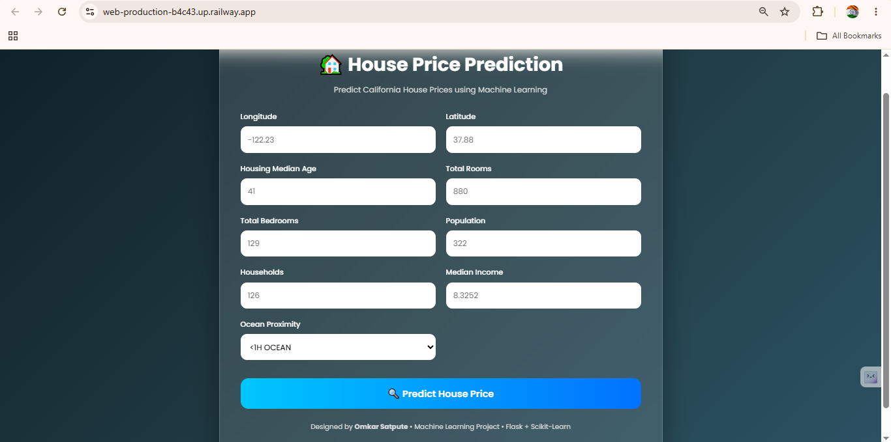
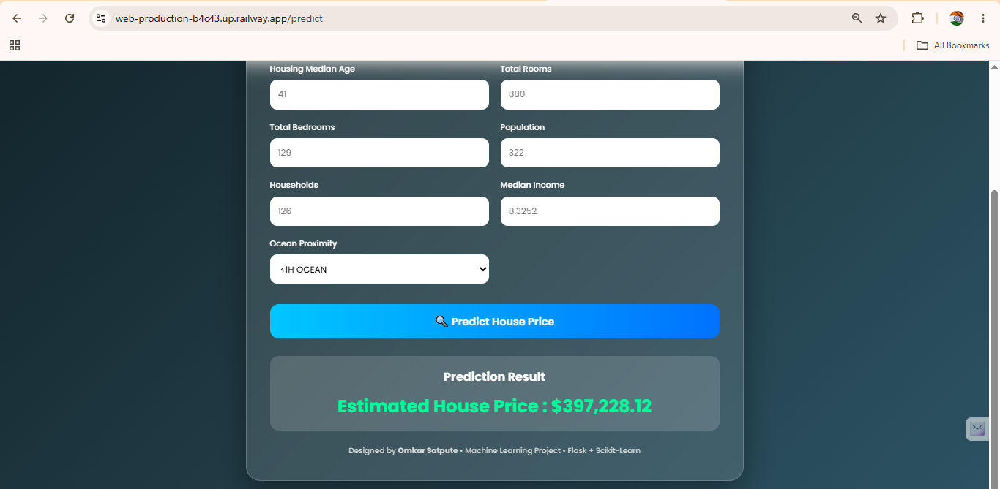

🏡 House Price Prediction using Machine Learning

A Machine Learning web application that predicts California house prices based on housing features such as location, income, population, and proximity to the ocean.

This project is built using **Python**, **Scikit-learn**, and **Flask**, with a trained **Random Forest Regressor** model.

---

## 🚀 Live Demo

🔗 **Live Application:** 

Example:

https://web-production-b4c43.up.railway.app/predict

---

## 📌 Features

- Predict house prices instantly
- User-friendly web interface
- Random Forest Regression model
- Automatic data preprocessing using Scikit-learn Pipeline
- One-Hot Encoding for categorical features
- Standard Scaling for numerical features
- Handles missing values using SimpleImputer
- Responsive UI

---

## 🖥️ Application Preview

Add screenshots here after deployment.

Example:





---

## 🛠️ Technologies Used

- Python
- Flask
- Scikit-learn
- Pandas
- NumPy
- Joblib
- HTML
- CSS

---

## 📊 Machine Learning Workflow

1. Load California Housing Dataset
2. Perform Stratified Sampling
3. Separate Features and Target
4. Data Preprocessing
   - Missing Value Imputation
   - Feature Scaling
   - One-Hot Encoding
5. Train Random Forest Regressor
6. Save Model using Joblib
7. Build Flask Web Application
8. Deploy the Application

---

## 📂 Project Structure

```
House_Price_Prediction/
│
├── app.py
├── model.pkl
├── pipline.pkl
├── requirements.txt
├── Procfile
├── runtime.txt
├── README.md
│
├── templates/
│   └── index.html
│
├── training/
│   ├── main.py
│   └── housing.csv
│
└── screenshots/
```

---

## 📥 Installation

Clone the repository

```bash
git clone https://github.com/omkarsatpute18/House_Price_Prediction.git
```

Go to project directory

```bash
cd House_Price_Prediction
```

Install dependencies

```bash
pip install -r requirements.txt
```

Run the Flask application

```bash
python app.py
```

Open your browser

```
http://127.0.0.1:5000
```

---

## 📈 Input Features

| Feature | Description |
|----------|-------------|
| Longitude | House Longitude |
| Latitude | House Latitude |
| Housing Median Age | Average Age of Houses |
| Total Rooms | Number of Rooms |
| Total Bedrooms | Number of Bedrooms |
| Population | Population in Area |
| Households | Number of Households |
| Median Income | Median Income of Residents |
| Ocean Proximity | Distance from Ocean |

---

## 🤖 Machine Learning Model

Algorithm Used

**Random Forest Regressor**

### Data Preprocessing

- SimpleImputer
- StandardScaler
- OneHotEncoder
- ColumnTransformer
- Pipeline

---

## 📚 Future Improvements

- Interactive Location Map
- Feature Importance Visualization
- Model Comparison Dashboard
- Price Trend Charts
- User Authentication
- API Support
- Docker Deployment

---

## 👨‍💻 Author

**Omkar Satpute**

GitHub:

https://github.com/omkarsatpute18

LinkedIn:

https://www.linkedin.com/in/omkar-satpute-221356349/

---

## ⭐ Support

If you found this project helpful, consider giving it a ⭐ on GitHub.
